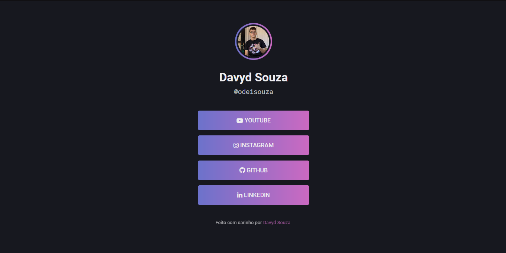

<h1 align="center">🌲 LinkTree</h1>
<p align="center">
  A landing page containing all social media from user
</p>
<h2 align="center">
  
</h2>
<p align="center">
  <a href="#tech">Technologies</a> •
  <a href="#use">How to Use</a> •
  <a href="#reference">Reference</a> •
  <a href="#author">Author</a>
</p>

---


<h2 id="tech">🚀 Technologies</h2>

<a href="https://developer.mozilla.org/en-US/docs/Web/HTML" target="_blank">
  
</a>
<a href="https://developer.mozilla.org/en-US/docs/Web/CSS" target="_blank">
  
</a>


<h2 id="use">ℹ️ How to Use</h2>

Before cloning the repository into your machine you'll need [Git](https://git-scm.com). Also it's good to have a code editor like [VSCode](https://code.visualstudio.com/) and [Live Server Extension](https://marketplace.visualstudio.com/items?itemName=ritwickdey.LiveServer) installed.
```bash
# Clone repository
$ git clone https://github.com/davyd-souza/hangman.git link-tree

# Go into repository
$ cd link-tree

# Start project on VSCode
$ code .

# Inside VSCode, click on index.html file
# Press Ctrl+Shift+P
# Type: Show Live Server Preview
# Press enter
```


<h2 id="reference">🧭 Reference</h2>

<p>
	This project was made following Rocketseat's <a href="https://lp.rocketseat.com.br/inscricao/maratona-explorer">Explorer Marathon</a>.
</p>
<p>
	You can <a href="https://www.figma.com/file/j8Fe7AGabn3hX2OCVLTB3i/Rocket-Links---Maratona-Explorer-2.0-(Community)?node-id=0%3A1">click here</a> to see reference layout on Figma
</p>


<h2 id="author">👤 Author</h2>

<p>
  Made with 💛 by Davyd Souza </br>
  <a href="https://www.linkedin.com/in/davyd-souza/" target="_blank" alt="LinnkedIn badge">
    
  </a>
  <a href="mailto:davyd.eduardo.souza@hotmail.com" target="_blank" alt="Outlook badge">
    
  </a>
  <a href="https://www.instagram.com/odeisouza/" target="_blank" alt="Instagram badge">
    
  </a>
</p>